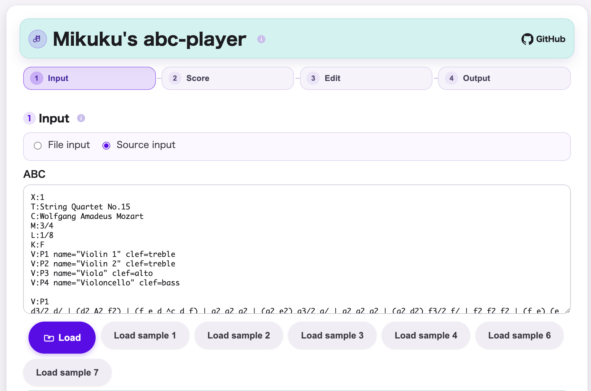
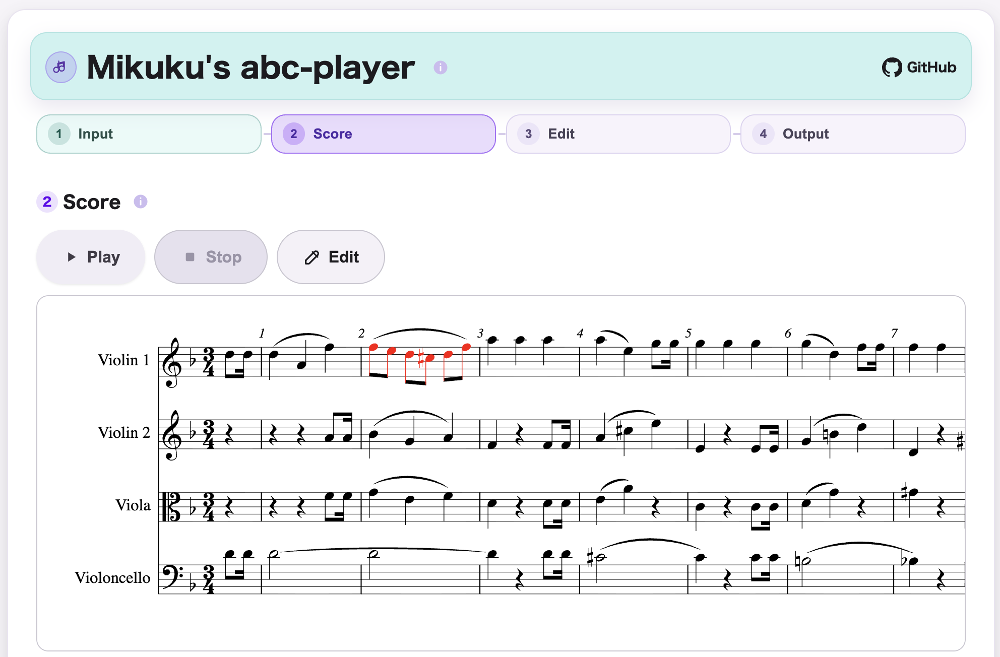
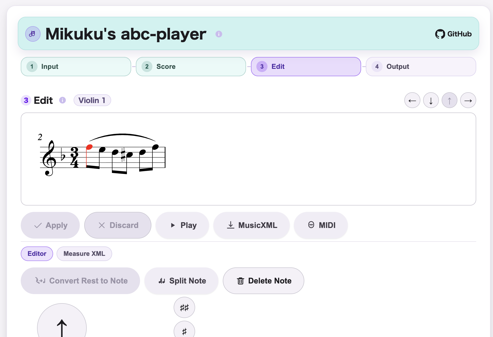
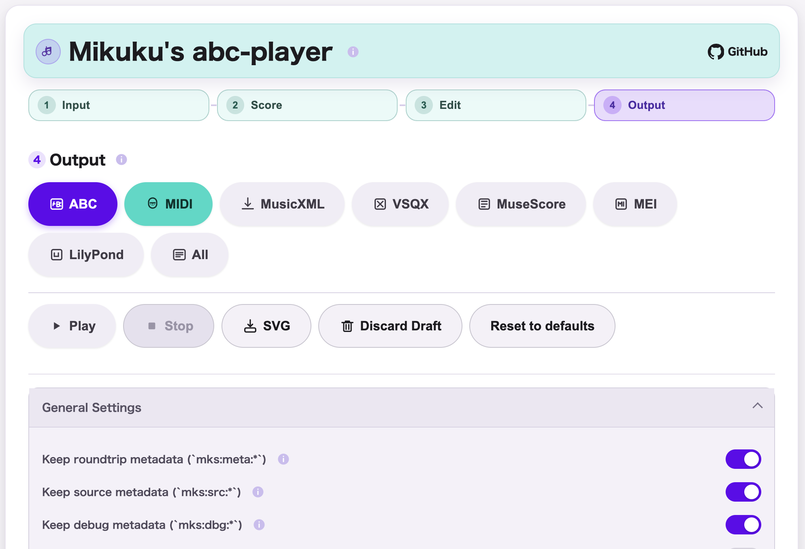

# miku-abc-player

`miku-abc-player` is a single-file web app that can load multiple supported formats, open them as ABC, and let you preview, play back, and make lightweight adjustments locally. Non-ABC inputs are normalized through MusicXML before being presented as ABC, while export to MIDI and other score formats remains available via mikuscore-derived functionality.

This project intentionally reuses and mimics `mikuscore` as much as practical.
It is not starting from a blank architectural style.

## Status

This repository is in active development.

Current focus:

- keep the app practical for real ABC preview and playback workflows
- continue incorporating relevant `mikuscore` improvements through vendored sync
- preserve the player-first product scope while keeping compatible import routes
- refine acceptance boundaries and regression coverage around `ABC <-> MusicXML`

## Product Goal

`miku-abc-player` provides a small, local, offline-capable ABC player with:

- ABC text input
- ABC file input
- import of other supported formats that open as ABC after MusicXML normalization
- score preview
- quick playback
- export to MIDI and other score formats
- smartphone-friendly single-page UI

Lightweight editing and output are inherited from `mikuscore`, but playback and preview remain primary.

## Relationship to `mikuscore`

This repository vendors `mikuscore` under `vendor/mikuscore/`.

The intention is:

- reuse existing ABC-related assets
- reuse existing playback-related assets
- reuse the single-file build philosophy
- reuse the `lht-cmn` UI component direction
- stay close to the same TypeScript and test baseline

`miku-abc-player` is a smaller derived app, not a full clone of `mikuscore`.

Its primary value is preview, playback, and quick verification, not strong score editing.

## Development Direction

The project intentionally keeps these `mikuscore` characteristics:

- single-file distribution artifact
- offline runtime
- split TypeScript source layout
- source-template HTML plus generated HTML
- `lht-cmn` based MD3-compatible UI composition
- `vitest` + `jsdom` test baseline

## Positioning

Primary:

- load ABC
- open supported non-ABC formats as ABC
- preview score
- play back quickly
- export when needed
- make small confirmation-oriented adjustments when needed

Secondary:

- lightweight edit inherited from `mikuscore`
- export inherited from `mikuscore`

Non-goal:

- become a strong full-featured score editor

## Use Cases

- paste ABC text and hear it quickly
- import an ABC file and verify the result
- import a supported non-ABC file and inspect it as generated ABC
- preview score rendering before sharing or exporting
- make small confirmation-oriented adjustments before replaying
- export loaded ABC into MIDI, MusicXML, and other score-related formats when conversion is needed

- ABC テキストを貼り付けてすぐに音を確認したい
- ABC ファイルを読み込んで内容を確認したい
- ABC 以外の対応形式を読み込み、生成された ABC として確認したい
- 共有や書き出しの前に譜面表示を確認したい
- 再生前に小さな確認用修正を行いたい
- 必要に応じて、読み込んだ ABC を MIDI や MusicXML などの譜面関連形式へ書き出したい

## How It Works

- load ABC directly in the browser, or import another supported format
- normalize imported content through MusicXML via reused `mikuscore` assets
- present the loaded score as ABC for preview, playback, and lightweight editing
- render the score for preview
- play back the score locally in the browser

- ブラウザ内で ABC を直接読み込む、または他の対応形式を取り込む
- 再利用している `mikuscore` アセットを通じて MusicXML に正規化する
- 正規化後の内容を ABC として扱い、プレビュー、再生、軽量編集へつなぐ
- プレビュー用に譜面を描画する
- ブラウザ内で譜面をローカル再生する

## Screenshots


English: Input screen for providing ABC directly or importing another supported format that will be normalized through MusicXML and opened as ABC.  
日本語: ABC を直接入力するか、他の対応形式を読み込んで MusicXML 正規化経由で ABC として開くための Input 画面です。


English: Score screen showing rendered notation for visual confirmation together with playback controls.  
日本語: 描画された譜面を見て内容を確認し、そのまま簡易再生できる Score 画面です。


English: Edit screen for lightweight note and measure adjustment inherited from mikuscore.  
日本語: mikuscore 由来の軽量で簡易な編集機能で、音符などの調整を行う Edit 画面です。


English: Output screen for exporting the current work as ABC, MIDI, MusicXML, and other score-related formats.  
日本語: 現在の内容を ABC、MIDI、MusicXML などの譜面関連形式として書き出すための Output 画面です。

## Repository Layout

Current layout:

```text
miku-abc-player/
  README.md
  docs/
  src/
  scripts/
  vendor/
    mikuscore/
```

The precise target layout is documented in [docs/MIMIC_POLICY.md](docs/MIMIC_POLICY.md).

## Documentation

- [CHANGELOG.md](CHANGELOG.md)
- [docs/README.md](docs/README.md)
- [docs/MIMIC_POLICY.md](docs/MIMIC_POLICY.md)
- [docs/PRODUCT_POSITIONING.md](docs/PRODUCT_POSITIONING.md)
- [docs/UPSTREAM_PROFILE_STRATEGY.md](docs/UPSTREAM_PROFILE_STRATEGY.md)

## License

This repository is licensed under Apache License 2.0.

Vendored components keep their own license and notice files where applicable.
